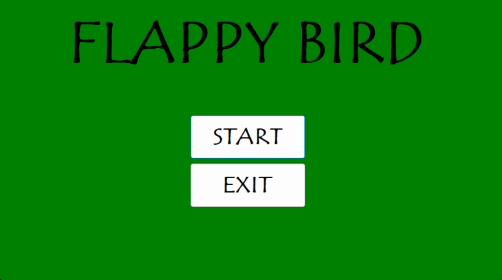
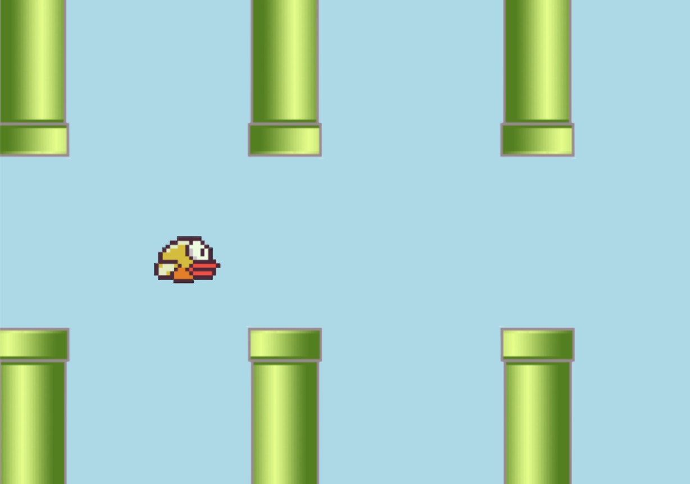

# Flappy Bird

A simple implementation of the Flappy Bird game using C#.

## Getting Started

### Prerequisites

- Visual Studio
- .NET Framework

### Installing

1. Clone the repository:
   ```bash
   git clone https://github.com/mazen251/Flappy-Bird.git
   ```

2. Open the project in Visual Studio:
   ```bash
   Open FlappyBird.sln
   ```

## Running the Game

To start the game, build and run the project in Visual Studio.

## How to Play

- Press the space bar to make the bird fly.
- Avoid the pipes and keep the bird alive as long as possible.
- Your score increases with each pipe you pass through.

## Game Controls

- **Space bar**: Make the bird fly

## GUI

### Start Menu


### The Game


## Built With

- [C#](https://docs.microsoft.com/en-us/dotnet/csharp/) - Programming language
- [.NET Framework](https://dotnet.microsoft.com/) - Development platform

## Note

This is not a complete project and only acts as a starting point for people who are interested in starting game development using C#. There are multiple errors that can be found in the code, and anyone interested can continue from here. As i will be uploading a new project that is made with unity game engine and C# in a new Repo.

## Author

- **Mazen** - [Mazen Walid](https://www.linkedin.com/in/mazen-walid-225582208/)

## Acknowledgments

- Inspired by the original Flappy Bird game by Dong Nguyen.

Enjoy the game!
